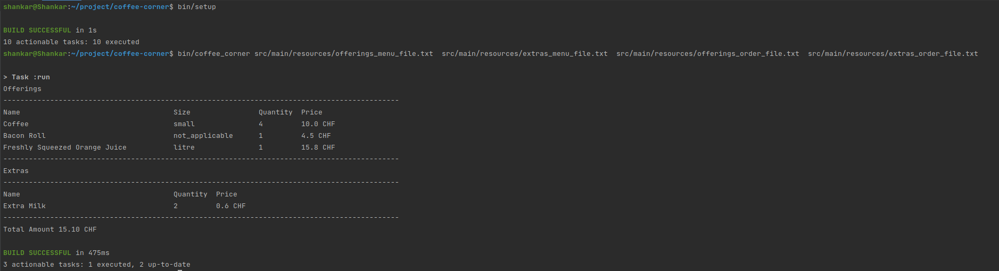

# Charlene Coffee Corner

### Assumptions
1. Offerings will be available in small, medium, large, litre.
2. Menu and Oder will be divided into Offerings and Extras.
3. We will provide either of the bonus free 5th beverage or free extra.
4. Item amount and order will be provided each time to calculate the billAmount.
5. Input Format Offerings  `Name  Type  Size  Quantity  Price`
6. Input Format Extras `Name  Quantity  Price`
7. File Used for Input, We can convert to console oriented as well
8. Security can also be implemented in future
9. Lombok can be used for boiler-plate code
10. Bill Amount displayed with 2 digit place
    
### Test
1. We can run `./gradlew test`  for running test cases

### Setup Dependencies
1. Java : JDK1.8
2. Build Tool : Gradle 4.10.3
3. Junit : 4.12
4. Mockito : 2.7.22
5. Hamcrest: 1.3

### Start Application
1. ApplicationLauncher is the main entry for application.
2. we can execute the command `coffee_corner <offerings_menu_file_path> <extras_menu_file_path> <offerings_order_file_path> <extras_order_file_path>` to run the application.
3. `bin/setup` for build and test the application.

### Output

